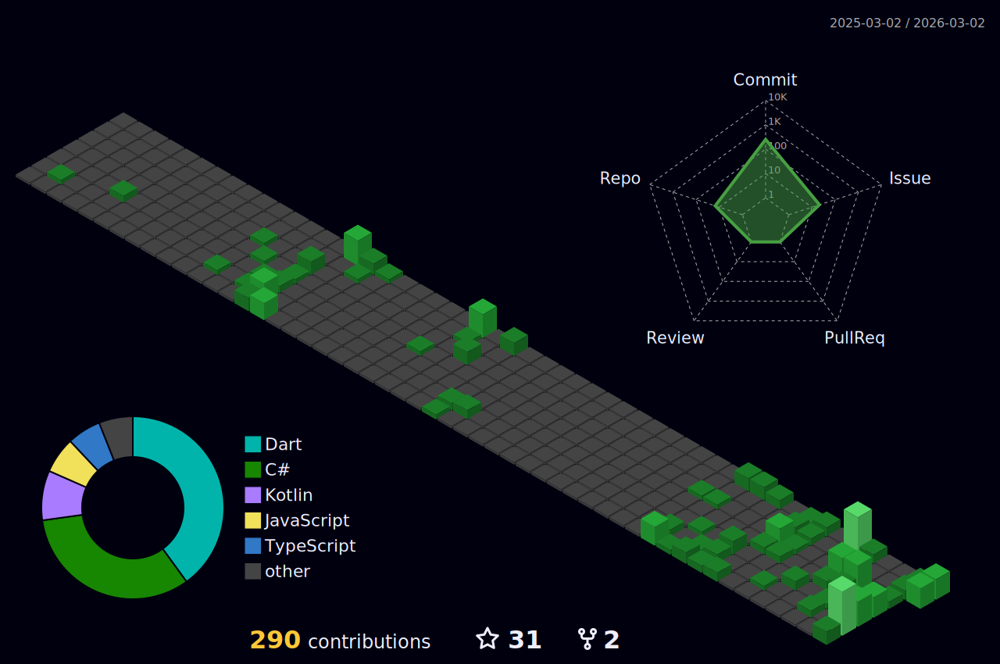

# 👋 Hi, I'm Hieu Nguyen

<div align="center">
  
[](https://hieu-nv.github.io)
[]()
[](mailto:hieunv@live.com)

</div>

Software engineer passionate about **hexagonal architecture**, **clean code**, and building maintainable systems across multiple technology stacks.

## 🚀 About Me

- 🏗️ Building maintainable backend systems with **hexagonal architecture**
- 💻 Working with **Kotlin**, **C#**, **Java**, and **TypeScript**
- 🎮 Unity game development with **MVVM/VIPER** patterns
- 🤖 Exploring **AI-assisted development** and **Copilot skills**
- 🌱 Cloud-native applications and microservice orchestration
- 🏆 **Achievements**: Pull Shark x2, Arctic Code Vault Contributor

## 🛠️ Tech Stack

```
Backend:   Kotlin • Java • Spring Boot • C# • .NET
Frontend:  TypeScript • JavaScript • React • Vue
Tools:     Git • Docker • AWS • Unity
Patterns:  Hexagonal Architecture • MVVM • VIPER • Clean Architecture
```

## 📊 GitHub Stats

<div align="center">



</div>

## 🌟 Featured Projects

### Recent Work
- 🚀 **[awesome-copilot](https://github.com/hieu-nv/awesome-copilot)** - Community-contributed GitHub Copilot configurations
- 🎯 **[antigravity-awesome-skills](https://github.com/hieu-nv/antigravity-awesome-skills)** - 700+ Agentic Skills for Claude/Cursor
- 🏗️ **[hexagon-dotnet-app](https://github.com/hieu-nv/hexagon-dotnet-app)** - Hexagonal architecture in .NET
- ⚡ **[hexagon-app](https://github.com/hieu-nv/hexagon-app)** - Hexagonal architecture in Kotlin

### Pinned Repositories
- � **[loxodon-framework](https://github.com/hieu-nv/loxodon-framework)** - MVVM & Databinding framework for Unity (C# and Lua)
- 🎮 **[unity-viper](https://github.com/hieu-nv/unity-viper)** - VIPER architecture implementation for Unity
- 🌐 **[hieu-nv.github.io](https://github.com/hieu-nv/hieu-nv.github.io)** ⭐ - Personal website
- 🔧 **[srv-mnt-api](https://github.com/hieu-nv/srv-mnt-api)** ⭐ - Java backend service
- 🔐 **[AppSecurity](https://github.com/hieu-nv/AppSecurity)** - Application security implementation
- 💻 **[srv-mnt-app](https://github.com/hieu-nv/srv-mnt-app)** - TypeScript frontend application

## 💞️ Open to Collaborate On

- 🌐 Open source projects in **Kotlin**, **C#**, or **TypeScript**
- 🏛️ Backend architecture and **hexagonal/clean architecture** implementations
- 🛠️ Developer tooling, libraries, and AI-assisted development tools
- 🎮 Unity frameworks and game architecture patterns

## 📈 Contribution Activity

```
📦 47 public repositories
⭐ Contributing to hexagonal architecture and AI tools
🔥 195 contributions in the last year
👥 11 followers • 13 following
```

## 📫 How to Reach Me

- **GitHub**: [@hieu-nv](https://github.com/hieu-nv)
- **Email**: [hieunv@live.com](mailto:hieunv@live.com)
- **Website**: [hieu-nv.github.io](https://hieu-nv.github.io)

---

<div align="center">

💡 *"Clean code always looks like it was written by someone who cares."* - Robert C. Martin


</div>
