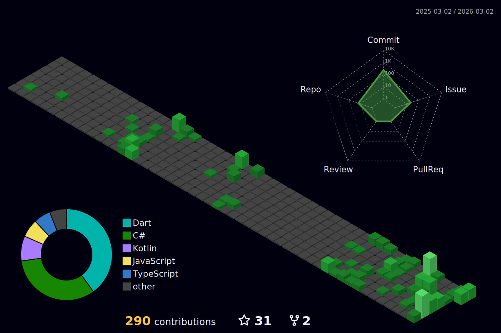

# 👋 Hi, I'm Hieu Nguyen

<div align="center">
  
[](https://hieu-nv.github.io)
[]()
[](mailto:hieunv@live.com)

</div>

Software engineer passionate about **hexagonal architecture**, **clean code**, and building maintainable systems across multiple technology stacks.

## 🚀 About Me

- 🏗️ Building maintainable backend systems with **hexagonal architecture** and **clean code** principles
- 💻 Polyglot developer working with **TypeScript**, **Java**, **C#**, **Kotlin**, and **Swift**
- 🎮 Unity game development with **MVVM/VIPER** architectural patterns
- 🤖 Active in **AI-assisted development**, creating **Copilot skills** and agentic workflows
- 🌱 Cloud-native applications, microservices, and modern software architecture
- 📚 47+ open source repositories across multiple tech stacks
- 🏆 **Achievements**: Pull Shark x2, Arctic Code Vault Contributor

## 🛠️ Tech Stack

**Backend:** Java • Spring Boot • C# • .NET • Kotlin • Node.js

**Frontend:** TypeScript • JavaScript • React • Swift • Compose

**Tools:** Git • Docker • AWS • Unity • GitHub Copilot

**Patterns:** Hexagonal Architecture • MVVM • VIPER • Clean Architecture • DDD

## 📊 GitHub Stats

<div align="center">



</div>

## 🌟 Featured Projects

### Recent Work
- ⚡ **[hexagon-app](https://github.com/hieu-nv/hexagon-app)** - Hexagonal architecture in Kotlin
- 🎯 **[zalloc](https://github.com/hieu-nv/zalloc)** - High-performance memory parsing (C#)
- 🚀 **[StreamChamp](https://github.com/hieu-nv/StreamChamp)** - iOS AVPlayer audio streaming (Swift)

### Pinned Repositories
- 🔐 **[AppSecurity](https://github.com/hieu-nv/AppSecurity)** - Application security implementation (Java)
- 🏗️ **[hexagon-dotnet-app](https://github.com/hieu-nv/hexagon-dotnet-app)** - Hexagonal architecture in .NET (C#)
- 🎨 **[Compose](https://github.com/hieu-nv/Compose)** - Modern UI development with Compose (C#)

## 💞️ Open to Collaborate On

- 🌐 Open source projects in **Kotlin**, **C#**, or **TypeScript**
- 🏛️ Backend architecture and **hexagonal/clean architecture** implementations
- 🛠️ Developer tooling, libraries, and AI-assisted development tools
- 🎮 Unity frameworks and game architecture patterns

## 📈 Contribution Activity

```
📦 47 public repositories
⭐ Contributing to hexagonal architecture and AI tools
🔥 464 contributions in the last year
👥 12 followers • 15 following
```

## 📫 How to Reach Me

- **GitHub**: [@hieu-nv](https://github.com/hieu-nv)
- **Email**: [hieunv@live.com](mailto:hieunv@live.com)
- **Website**: [hieu-nv.github.io](https://hieu-nv.github.io)

---

<div align="center">

💡 *"Clean code always looks like it was written by someone who cares."* - Robert C. Martin


</div>
