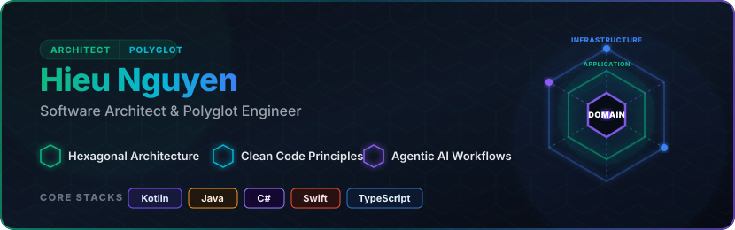

# 👋 Hi, I'm Hieu Nguyen

  

  

  <strong>Software Architect & Polyglot Engineer</strong> passionate about <strong>hexagonal architecture</strong>, <strong>clean code</strong>, and building maintainable, high-performance systems across multiple tech stacks.

---

### 🚀 About Me

- 🏗️ **Architectural Design**: Specialized in building maintainable, scalable backend systems using **Hexagonal Architecture (Ports & Adapters)**, **Clean Architecture**, and **Domain-Driven Design (DDD)**.
- 💻 **Polyglot Developer**: Actively developing production-ready code in **Kotlin**, **Java**, **C# (.NET)**, **TypeScript**, and **Swift**.
- 🎮 **Game Architecture**: Designing Unity game structures utilizing modern frontend patterns like **MVVM** and **VIPER**.
- 🤖 **Agentic AI**: Pioneer in **AI-assisted development**, creating customized **Copilot skills** and automated agentic development workflows.
- 🏆 **GitHub Achievements**: Triple **Pull Shark** recipient (`Pull Shark x3`) and **Arctic Code Vault Contributor**.

---

### 🛠️ Tech Stack

<table width="100%">
  <tr>
    <td width="50%" valign="top">
      <h4>💻 Languages</h4>
      
      
      
      
       
      
      
    </td>
    <td width="50%" valign="top">
      <h4>⚙️ Backend & Frameworks</h4>
      
      
      
       
      
      
    </td>
  </tr>
  <tr>
    <td valign="top">
      <h4>🛠️ Tools & DevOps</h4>
      
      
      
       
      
      
    </td>
    <td valign="top">
      <h4>📐 Architecture & Patterns</h4>
      
      
      
       
      
      
    </td>
  </tr>
</table>

---

### 📊 GitHub Activity & Stats

  

<table width="100%">
  <tr>
    <td width="50%" valign="top">
      <h4>📈 Contribution Activity</h4>
      <ul>
        <li>📦 <strong>50+ public repositories</strong> across multiple tech stacks</li>
        <li>⭐ <strong>Open Source Champion</strong> in Hexagonal Architecture &amp; developer tooling</li>
        <li>🔥 <strong>1,161 contributions</strong> in the last year alone</li>
        <li>👥 <strong>12 followers</strong> • <strong>16 following</strong></li>
      </ul>
    </td>
    <td width="50%" valign="top">
      <h4>💞️ Open to Collaborate On</h4>
      <ul>
        <li>🌐 Open source projects in <strong>Kotlin</strong>, <strong>C#</strong>, or <strong>TypeScript</strong></li>
        <li>🏛️ Backend systems leveraging <strong>hexagonal/clean architecture</strong></li>
        <li>🛠️ Developer tooling, custom CLI libraries, and AI-agent workflows</li>
        <li>🎮 Unity frameworks and high-performance game architecture</li>
      </ul>
    </td>
  </tr>
</table>

---

### 🌟 Featured Projects

| Project | Primary Stack | Architecture &amp; Key Highlights |
| :--- | :--- | :--- |
| ⚡ **[hexagon-app](https://github.com/hieu-nv/hexagon-app)** | `Kotlin` `Spring Boot` | Master-class blueprint of **Hexagonal Architecture** in Kotlin, showing decoupled core business rules from REST/database layers. |
| 🎯 **[zalloc](https://github.com/hieu-nv/zalloc)** | `C#` `.NET Core` | Extreme high-performance memory parsing engine in C# using advanced memory primitives (`Span<T>`, `Memory<T>`) for zero-allocation. |
| 🚀 **[StreamChamp](https://github.com/hieu-nv/StreamChamp)** | `Swift` `iOS` | High-fidelity iOS audio streaming library leveraging `AVPlayer` for smooth, low-latency background playback. |
| 🔐 **[AppSecurity](https://github.com/hieu-nv/AppSecurity)** | `Java` `Spring Security` | Hardened application security template with custom token verification, OAuth2 integration, and microservices authorization. |
| 🏗️ **[hexagon-dotnet-app](https://github.com/hieu-nv/hexagon-dotnet-app)** | `C#` `.NET` `DDD` | Enterprise-grade implementation of Hexagonal Architecture in .NET, proving C# clean code and domain decoupling concepts. |
| 🎨 **[Compose](https://github.com/hieu-nv/Compose)** | `C#` `Unity` | Modern UI Toolkit integration for Unity, creating declarative and reactive UI modules inspired by Jetpack Compose. |

---

### 📫 How to Reach Me

  

---

💡 *"Clean code always looks like it was written by someone who cares."*
 
— **Robert C. Martin (Uncle Bob)**

 

