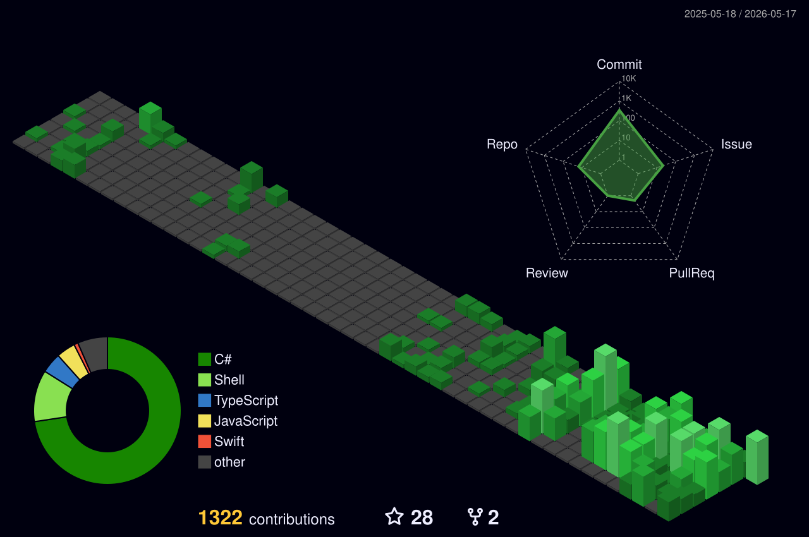

# Hi, I'm Hieu Nguyen 👋

### Software Engineer · Architecture Enthusiast · Polyglot Developer

I build maintainable software with clean boundaries, pragmatic patterns, and a focus on developer experience.

## About me

- 🏗️ I explore **hexagonal architecture**, **clean architecture**, and **domain-driven design**.
- 💻 I work across **Kotlin**, **Java**, **C#**, **TypeScript**, and **Swift**.
- ⚡ I enjoy performance engineering, expressive APIs, and well-tested systems.
- 🤖 I create reusable **AI agent skills** that automate software-engineering workflows.
- 🎮 I experiment with architecture and functional patterns for Unity and iOS applications.

## Featured work

| Project | What it explores | Stack |
| :-- | :-- | :-- |
| [**agent-skills**](https://github.com/hieu-nv/agent-skills) | Reusable agent skills for pull requests, merge requests, and issue workflows | Shell · AI tooling |
| [**hexagon-app**](https://github.com/hieu-nv/hexagon-app) | Ports-and-adapters architecture with a framework-independent core | Kotlin · Spring Boot · Gradle |
| [**hexagon-dotnet-app**](https://github.com/hieu-nv/hexagon-dotnet-app) | Minimal APIs, persistence, external gateways, observability, and testing | C# · ASP.NET Core · EF Core |
| [**zalloc**](https://github.com/hieu-nv/zalloc) | Benchmarked zero-allocation string parsing with `ReadOnlySpan<char>` | C# · .NET · BenchmarkDotNet |
| [**Compose**](https://github.com/hieu-nv/Compose) | Left-to-right function composition through a small, expressive API | C# · .NET |
| [**StreamChamp**](https://github.com/hieu-nv/StreamChamp) | Local and remote media playback on iOS | Swift · SwiftUI · AVFoundation |

## Toolbox

  

**Architecture:** Hexagonal Architecture · Clean Architecture · DDD · TDD · MVVM · VIPER

## GitHub activity

## Let's build something

I'm interested in collaborating on clean backend architecture, developer tooling, performance-focused libraries, and AI-assisted engineering workflows.

[**Explore my projects**](https://github.com/hieu-nv?tab=repositories) · [**Visit my website**](https://hieunv.vercel.app) · [**Send me an email**](mailto:hieunv@live.com)

